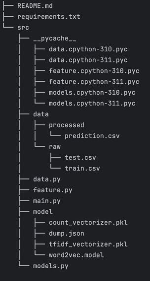

# Projet de Modélisation et Prédiction

Ce projet utilise Python 3.10.15 pour effectuer des tâches de traitement de données, de modélisation et de prédiction sur des jeux de données textuels.

## Structure du Projet

La structure des répertoires est la suivante :



## Prérequis

Assurez-vous d'avoir Python 3.10.15 installé. Installez les dépendances avec la commande suivante :

```bash
pip install -r requirements.txt
```

## Utilisation
Le fichier principal pour l'exécution est src/main.py. Voici les commandes de base disponibles pour l'entraînement, la prédiction, et l'évaluation du modèle :

### Entraînement du Modèle
Cette commande entraîne le modèle avec les données de train et enregistre le modèle entraîné dans le répertoire model.
```
python src/main.py train --input_filename=data/raw/train.csv --model_dump_filename=models/model.json
```
### Prédiction
Cette commande utilise un modèle entraîné pour effectuer des prédictions sur un jeu de données et enregistre les prédictions dans un fichier CSV.
```
python src/main.py predict --input_filename=data/raw/test.csv --model_dump_filename=models/model.json --output_filename=data/processed/prediction.csv
```
### Évaluation du Modèle
Cette commande évalue un modèle en utilisant les données de train.
```
python src/main.py evaluate --input_filename=data/raw/train.csv
```


